# 🎮 QueueQuest: The Vending Machine Challenge


> **Simulasi Antrian Vending Machine Interaktif dengan Pendekatan M/M/1 System**

QueueQuest adalah aplikasi simulasi web modern yang memvisualisasikan teori antrian (Queueing Theory) menggunakan studi kasus Vending Machine. Proyek ini menggabungkan analisis statistik yang akurat dengan visualisasi **Pixel Art** yang menarik untuk membuat pembelajaran riset operasi menjadi menyenangkan.

---

## 👥 Meet The Heroes

Pilih karakter favorit Anda dan lihat bagaimana mereka berinteraksi dalam simulasi!

<div align="center">
  
  
  
  
  
</div>

---

## ✨ Fitur Utama

### 🎯 1. Simulasi Monte Carlo M/M/1
Simulasi kedatangan dan pelayanan pelanggan secara real-time berdasarkan distribusi Poisson dan Eksponensial.
- **Arrival Rate ($\lambda$)**: Laju kedatangan pelanggan.
- **Service Rate ($\mu$)**: Kecepatan pelayanan mesin.
- **Visualisasi Dinamis**: Animasi antrian yang menyesuaikan dengan kondisi (Overloaded, Rush Hour, Efficient, Relaxed).

### 🎨 2. Visualisasi Pixel Art Retro
Pengalaman visual yang imersif dengan tema **Game Retro**:
- **Dynamic Backgrounds**: Latar belakang berubah sesuai kondisi antrian (Taman, Stasiun, Kota Cyber, dll).
- **Interactive Animations**: Karakter berjalan, mengantri, dan berinteraksi.
- **Retro UI**: Komponen antarmuka dengan gaya pixel art modern.

### 📊 3. Analisis & Pelaporan
- **Real-time Chart**: Grafik garis dinamis memantau panjang antrian VS waktu.
- **Heatmap Calendar**: Visualisasi frekuensi simulasi.
- **Export to Spreadsheet**: Integrasi langsung dengan Google Sheets untuk menyimpan data simulasi.
- **Leaderboard**: Pantau skor efisiensi terbaik dari berbagai skenario.

---

## 🛠️ Tech Stack

Project ini dibangun menggunakan teknologi web modern untuk performa tinggi dan developer experience yang baik.

### Frontend (`vending-fe`)
- **Framework**: [Astro](https://astro.build/) - Untuk performa statis yang cepat.
- **UI Library**: [Preact](https://preactjs.com/) - Ringan dan cepat untuk interaktivitas.
- **Styling**: [Tailwind CSS](https://tailwindcss.com/) - Utility-first CSS framework.
- **State Management**: [Nano Stores](https://github.com/nanostores/nanostores).
- **Icons**: Lucide Icons.

### Backend (`vending-be`)
- **Runtime**: Node.js.
- **Framework**: Express.js.
- **Database/Storage**: Google Sheets API (sebagai database ringan untuk log simulasi).

---

## � Arsitektur Sistem

```mermaid
graph TB
    subgraph Frontend["🖥️ Frontend (Astro + Preact)"]
        UI[SimulationForm]
        Animation[QueueAnimation]
        Results[ResultsSection]
        Store[(simulationStore)]
        
        UI --> Store
        Store --> Animation
        Store --> Results
    end
    
    subgraph Backend["⚙️ Backend (Node.js + Express)"]
        API["/api/simulate"]
        Simulator[simulator.js]
        Sheets[googleSheets.js]
        
        API --> Simulator
        Simulator --> Sheets
    end
    
    subgraph External["☁️ External Services"]
        GSheets[(Google Sheets API)]
    end
    
    UI -->|"POST /api/simulate"| API
    API -->|"Response JSON"| Store
    Sheets -->|"Save Data"| GSheets
```



## 🔄 Alur Simulasi

```mermaid
sequenceDiagram
    participant U as User
    participant F as Frontend
    participant B as Backend
    participant S as Simulator
    participant G as Google Sheets
    
    U->>F: Pilih Preset / Input Parameter
    F->>F: Validasi (λ < μ)
    F->>B: POST /api/simulate
    
    B->>S: runSimulation(λ, μ, N)
    
    loop Untuk setiap pelanggan i = 1 to N
        S->>S: Generate U1, U2 (random)
        S->>S: X1 = -ln(U1)/λ
        S->>S: X2 = -ln(U2)/μ
        S->>S: Hitung arrival, service, departure
    end
    
    S->>S: Hitung statistik & skor
    S-->>B: Return hasil simulasi
    
    B->>G: Simpan ke Leaderboard
    B-->>F: Response JSON
    
    F->>F: Update simulationStore
    F->>U: Tampilkan animasi & hasil
```



## 📊 Flowchart Algoritma M/M/1

```mermaid
flowchart TD
    A([Start]) --> B[/Input: λ, μ, N/]
    B --> C{λ < μ?}
    C -->|No| D[Error: Sistem tidak stabil]
    C -->|Yes| E[Initialize: i=1, prevArr=0, prevDep=0]
    
    E --> F{i <= N?}
    F -->|No| L[Hitung Statistik Rata-rata]
    F -->|Yes| G[Generate U1, U2 ~ Uniform 0,1]
    
    G --> H["X1 = -ln(U1)/λ (Interarrival)"]
    H --> I["X2 = -ln(U2)/μ (Service)"]
    I --> J["Arrival = prevArr + X1
    Begin = max(Arrival, prevDep)
    Departure = Begin + X2"]
    
    J --> K["Queue Time = Begin - Arrival
    System Time = Departure - Arrival"]
    
    K --> M[Simpan hasil pelanggan i]
    M --> N[prevArr = Arrival, prevDep = Departure]
    N --> O[i = i + 1]
    O --> F
    
    L --> P[Bandingkan dengan Nilai Teoritis]
    P --> Q[Hitung Skor & Badge]
    Q --> R([End])
```



---

## �🚀 Cara Menjalankan

Ikuti langkah-langkah berikut untuk menjalankan proyek di lokal komputer Anda.

### Prasyarat
- Node.js (v18+)
- NPM atau PNPM

### 1. Clone Repository
```bash
git clone https://github.com/username/queue-quest.git
cd queue-quest
```

### 2. Setup Backend
```bash
cd vending-be
npm install
# Setup env jika diperlukan
npm run dev
```
Backend akan berjalan di `http://localhost:3001`

### 3. Setup Frontend
Buka terminal baru:
```bash
cd vending-fe
npm install
npm run dev
```
Frontend akan berjalan di `http://localhost:4321`

---

## 📸 Screenshots

| Dashboard Simulasi | Animasi Antrian |
|:---:|:---:|
| Visualisasi parameter dan kontrol simulasi yang intuitif. | Tampilan Pixel Art yang berubah dinamis sesuai kepadatan antrian. |

---

## 👨‍💻 Tim Pengembang

Alvin, Ilham, Farhans

---

© 2026 QueueQuest. All rights reserved.
