```mermaid
graph TB
    subgraph Frontend["🖥️ Frontend (Astro + Preact)"]
        UI[SimulationForm]
        Animation[QueueAnimation]
        Results[ResultsSection]
        Store[(simulationStore)]
        
        UI --> Store
        Store --> Animation
        Store --> Results
    end
    
    subgraph Backend["⚙️ Backend (Node.js + Express)"]
        API["/api/simulate"]
        Simulator[simulator.js]
        Sheets[googleSheets.js]
        
        API --> Simulator
        Simulator --> Sheets
    end
    
    subgraph External["☁️ External Services"]
        GSheets[(Google Sheets API)]
    end
    
    UI -->|"POST /api/simulate"| API
    API -->|"Response JSON"| Store
    Sheets -->|"Save Data"| GSheets
```

```mermaid
sequenceDiagram
    participant U as User
    participant F as Frontend
    participant B as Backend
    participant S as Simulator
    participant G as Google Sheets
    
    U->>F: Pilih Preset / Input Parameter
    F->>F: Validasi (λ < μ)
    F->>B: POST /api/simulate
    
    B->>S: runSimulation(λ, μ, N)
    
    loop Untuk setiap pelanggan i = 1 to N
        S->>S: Generate U1, U2 (random)
        S->>S: X1 = -ln(U1)/λ
        S->>S: X2 = -ln(U2)/μ
        S->>S: Hitung arrival, service, departure
    end
    
    S->>S: Hitung statistik & skor
    S-->>B: Return hasil simulasi
    
    B->>G: Simpan ke Leaderboard
    B-->>F: Response JSON
    
    F->>F: Update simulationStore
    F->>U: Tampilkan animasi & hasil
```

# 🎮 QueueQuest: The Vending Machine Challenge

<div align="center">
  

  <br />
  
  [](https://astro.build/)
  [](https://preactjs.com/)
  [](https://tailwindcss.com/)
  [](https://www.typescriptlang.org/)
  
  <p align="center">
    <b>Simulasi Antrian Vending Machine Interaktif dengan Pendekatan M/M/1 System</b>
  </p>
</div>

---

## 📖 Tentang Project

**QueueQuest** adalah aplikasi simulasi web modern yang memvisualisasikan **Teori Antrian (Queueing Theory)** menggunakan studi kasus Vending Machine. Proyek ini menggabungkan analisis statistik yang akurat dengan visualisasi **Pixel Art** yang menarik untuk membuat pembelajaran riset operasi menjadi menyenangkan dan interaktif.

Project ini terdiri dari dua bagian utama:
- **Frontend**: Dibangun dengan Astro & Preact untuk performa tinggi dan animasi halus.
- **Backend**: Node.js & Express untuk logika simulasi Monte Carlo dan pencatatan data.

---

## 👥 Meet The Heroes

Pilih karakter favorit Anda dan lihat bagaimana mereka berinteraksi dalam simulasi!

<div align="center">
  
  
  
  
  
  
</div>

---

## ✨ Fitur Utama

### 🎯 1. Simulasi Monte Carlo M/M/1
Simulasi kedatangan dan pelayanan pelanggan secara real-time berdasarkan distribusi Poisson dan Eksponensial.
- **Arrival Rate ($\lambda$)**: Laju kedatangan pelanggan.
- **Service Rate ($\mu$)**: Kecepatan pelayanan mesin.
- **Visualisasi Dinamis**: Animasi antrian yang menyesuaikan dengan kondisi (*Overloaded*, *Rush Hour*, *Efficient*, *Relaxed*).

### 🎨 2. Visualisasi Pixel Art Retro
Pengalaman visual yang imersif dengan tema **Game Retro**:
- **Dynamic Backgrounds**: Latar belakang berubah sesuai kondisi antrian (Taman, Stasiun, Kota Cyber, dll).
- **Interactive Animations**: Karakter berjalan, mengantri, dan berinteraksi.
- **Retro UI**: Komponen antarmuka dengan gaya pixel art modern (Scanlines, Pixel Fonts).

### 📊 3. Analisis & Pelaporan
- **Real-time Chart**: Grafik garis dinamis memantau panjang antrian VS waktu.
- **Heatmap Calendar**: Visualisasi frekuensi simulasi.
- **Export to Spreadsheet**: Integrasi langsung dengan Google Sheets untuk menyimpan data simulasi.
- **Leaderboard**: Pantau skor efisiensi terbaik dari berbagai skenario.

---

## 🛠️ Tech Stack

### Frontend (`vending-fe`)
| Teknologi | Kegunaan |
|-----------|----------|
| **[Astro](https://astro.build/)** | Framework utama untuk Static Site Generation (SSG). |
| **[Preact](https://preactjs.com/)** | Library UI ringan (3kb) untuk komponen interaktif. |
| **[Tailwind CSS](https://tailwindcss.com/)** | Styling cepat dengan utility-first classes. |
| **[Nano Stores](https://github.com/nanostores/nanostores)** | State management yang ringan dan framework-agnostic. |
| **Lucide Icons** | Ikon vektor yang bersih dan konsisten. |

### Backend (`vending-be`)
| Teknologi | Kegunaan |
|-----------|----------|
| **Node.js** | Runtime environment. |
| **Express.js** | Web framework untuk API. |
| **Google Sheets API** | Database ringan untuk menyimpan log simulasi. |

---

## 🏗️ Arsitektur Sistem

High-level architecture dari sistem QueueQuest:



### 🔄 Alur Simulasi
Bagaimana data mengalir dari input user hingga hasil ditampilkan:



---

## 🚀 Cara Menjalankan

Ikuti langkah-langkah berikut untuk menjalankan proyek di lokal komputer Anda.

### Prasyarat
- **Node.js** (v18+)
- **NPM** atau **PNPM**

### 1. Clone Repository
```bash
git clone https://github.com/username/queue-quest.git
cd queue-quest
```

### 2. Setup Backend & Frontend
Kami menyarankan menjalankan frontend dan backend secara bersamaan di terminal yang berbeda.

**Terminal 1: Backend**
```bash
cd vending-be
npm install
# Setup env jika diperlukan (lihat .env.example)
npm run dev
# Server berjalan di http://localhost:3001
```

**Terminal 2: Frontend**
```bash
cd vending-fe
npm install
npm run dev
# Frontend berjalan di http://localhost:4321
```

---

## 👨‍💻 Tim Pengembang

| Nama | Role |
|------|------|
| **Alvin** | Fullstack Developer |
| **Ilham** | Frontend Engineer |
| **Farhan** | Simulation & Logic Specialist |

---

<p align="center">
  © 2026 QueueQuest. Built with ❤️ and lots of coffee.
</p>
